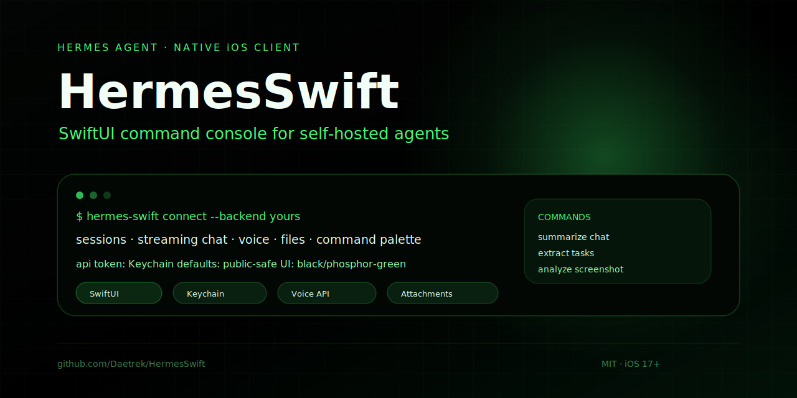

<p align="center">
  
</p>

<p align="center">
  <a href="https://hermes-agent.nousresearch.com/"></a>
  
  
</p>

# HermesSwift

**HermesSwift** is a native SwiftUI iOS client for [Hermes Agent](https://hermes-agent.nousresearch.com/): a mobile command console for chat sessions, voice, attachments, and fast agent actions.

It is designed around a **true-black / phosphor-green terminal UI** and a self-hosted Hermes API server.

> HermesSwift is a client app only. It does not include or host a Hermes backend.

## Why this project exists

Most agent interfaces are desktop-first. HermesSwift explores what an agent console feels like when it is:

- native on iPhone
- fast enough for one-handed use
- private-backend friendly
- voice-capable
- file/image aware
- visually distinct instead of generic chat gray

## Highlights

| Area | What HermesSwift includes |
|---|---|
| Native UI | SwiftUI screens, session list, chat, settings, diagnostics |
| Visual identity | True black shell with custom phosphor green theme |
| Chat | Hermes sessions, new chats, sync send, streaming fallback |
| Attachments | Upload-first image/file flow with pending attachment cards |
| Markdown | Rich markdown/code rendering with copy affordances |
| Voice | Push-to-talk transcription and optional speech playback |
| Organization | Local rename, pin, archive, search, and filters |
| Command palette | Summarize, extract tasks, debug latest error, screenshot analysis |
| Security | API token stored in iOS Keychain |

## Preview

The current public build ships with a terminal-style interface:

```text
black background
phosphor green text
command palette
voice controls
attachment cards
session organization
```

The hero above is a stylized preview; real device screenshots may vary based on your Hermes deployment and iOS settings.

## Requirements

- macOS with full Xcode installed
- iOS 17+
- [XcodeGen](https://github.com/yonaskolb/XcodeGen)
- A running [Hermes Agent](https://hermes-agent.nousresearch.com/) API server
- A Hermes API token

Install XcodeGen:

```bash
brew install xcodegen
```

## Configure Hermes

Start or configure your Hermes API server using the official docs:

https://hermes-agent.nousresearch.com/docs

HermesSwift intentionally ships with **no public default API URL**. On first launch, enter your own Hermes API server URL, for example:

```text
http://192.168.1.20:8642
https://your-host.example.com
```

Then paste your Hermes API token. HermesSwift stores it in the iOS Keychain.

## Optional voice endpoint

Voice features expect an OpenAI-style audio API compatible with:

```text
GET  /v1/audio/voices
POST /v1/audio/transcriptions
POST /v1/audio/speech
```

Leave the voice URL blank if you only want text chat.

## Build

Generate the Xcode project:

```bash
git clone https://github.com/Daetrek/HermesSwift.git
cd HermesSwift
xcodegen generate
open HermesSwift.xcodeproj
```

In Xcode:

1. Select the `HermesSwift` target.
2. Set your own Apple Development Team.
3. Change the bundle identifier if needed.
4. Build and run on your iPhone.

CLI simulator build:

```bash
xcodegen generate
xcodebuild \
  -project HermesSwift.xcodeproj \
  -scheme HermesSwift \
  -configuration Debug \
  -destination 'generic/platform=iOS Simulator' \
  build
```

## Architecture

```text
HermesSwift iOS app
├─ SwiftUI views
├─ Keychain token storage
├─ Hermes API client
│  ├─ sessions
│  ├─ messages
│  ├─ chat send / stream fallback
│  └─ attachments
└─ optional voice client
   ├─ transcription
   ├─ speech
   └─ voice list
```

## Security notes

- API tokens are stored in Keychain, not source or UserDefaults.
- Do not commit your API URL or token if it reveals private infrastructure.
- The app is a client. Server-side permissions, data access, and safety controls must be enforced by your Hermes deployment.
- The public repo uses generic defaults and does not include private hostnames, Apple team IDs, or credentials.

## Roadmap ideas

- theme selector
- screenshot gallery
- server-backed session metadata sync
- local transcript search
- richer attachment history
- TestFlight-friendly setup flow

## License

MIT — see [`LICENSE`](LICENSE).
